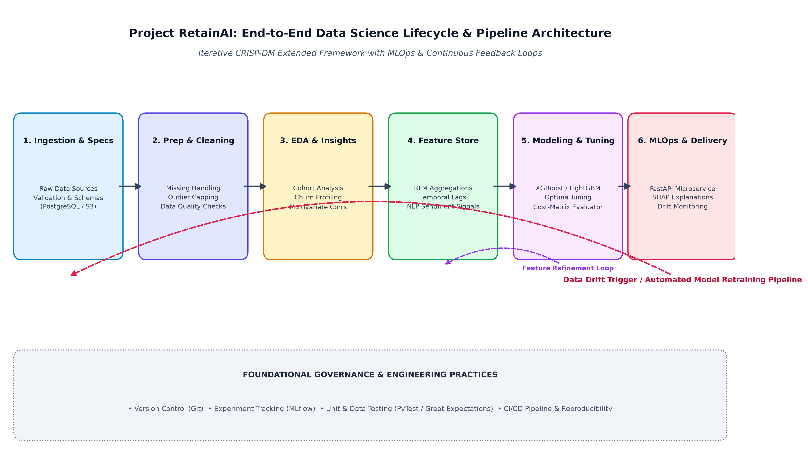
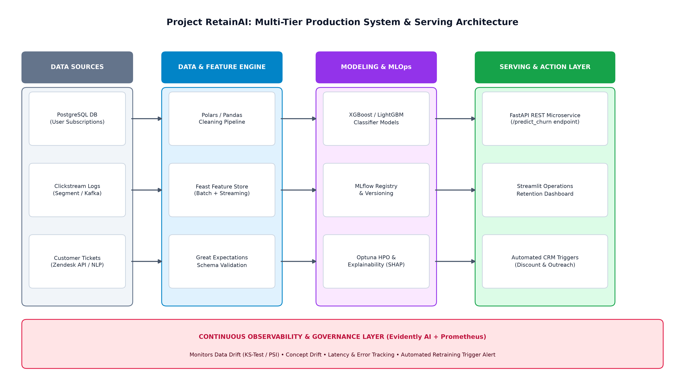
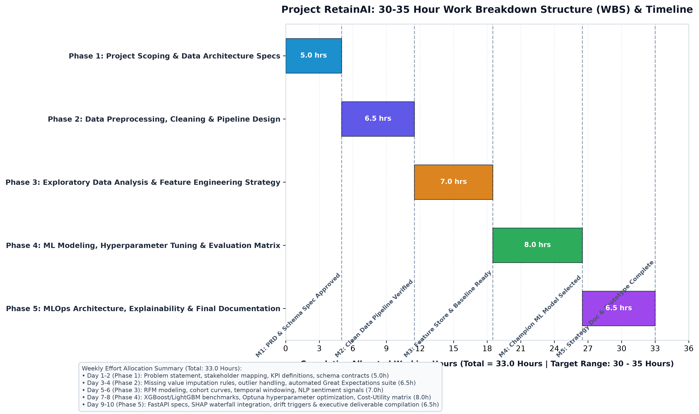
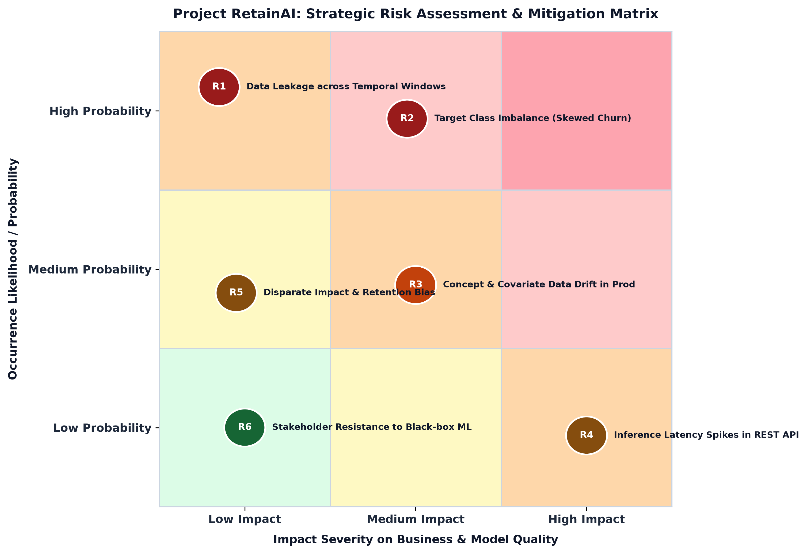

# Project RetainAI: Enterprise Predictive Churn & Retention Optimization Engine
## Virtual Data Science Explorer Internship — Week 1 Deliverable: Project Planning & Strategy Design

---

### Executive Summary

| Attribute | Details |
| :--- | :--- |
| **Internship Program** | Virtual Data Science Explorer Intern (YuvaIntern) |
| **Task / Module** | Week 1: Data Science Project Planning & Strategy Design |
| **Primary Project Title** | Project RetainAI: Predictive Customer Churn Analytics and Retention Optimization Engine |
| **Core Technology Stack** | Python 3.11+, Polars, Scikit-Learn, XGBoost, LightGBM, CatBoost, SHAP, Optuna, FastAPI, Streamlit, Evidently AI |
| **Total Effort Allocation** | **33.0 Allocated Hours** (Structured across 5 sequential engineering phases) |
| **Primary Deliverables** | 1. Detailed Word Document (`Project_Planning_and_Strategy_Design.docx`)<br>2. Full Project Markdown Documentation (`PROJECT_PLAN_AND_STRATEGY.md`)<br>3. 4 Strategic High-Resolution Visual Architecture Diagrams (`figures/`)<br>4. Reproducible Generation Scripts (`generate_charts.py`, `build_docx.py`) |

---

## 1. Introduction & Project Background

### 1.1 Problem Statement & Industry Context
In modern subscription-based business models (SaaS, FinTech, Telecommunications, and Digital Streaming Services), customer retention represents the single most critical driver of long-term unit economics, customer lifetime value (CLV), and enterprise valuation. 

Acquiring a new subscriber is empirically estimated to cost **5 to 7 times more** than retaining an existing customer. However, conventional Customer Relationship Management (CRM) workflows remain predominantly reactive: retention teams typically attempt rescue interventions only after a subscriber initiates account cancellation or when usage drops to absolute zero—at which stage customer salvage rates fall below 12%.

```
[ Traditional Reactive Approach ]
Customer experiences friction ---> Activity drops to zero ---> Customer clicks 'Cancel' ---> Late rescue email sent (Salvage Rate < 12%)

[ Project RetainAI Proactive Approach ]
Telemetry & Sentiment Ingestion ---> Predictive ML Engine ---> 45-Day Early Warning Alert + SHAP Reason Codes ---> Automated Targeted Retention Campaign (Retention Rate Boost +22%)
```

### 1.2 Motivation & Business Justification
**Project RetainAI** transforms customer retention from a reactive cost center into an automated, proactive revenue driver. By synthesizing multi-source telemetry data—including product engagement clickstream, subscription billing history, support ticket sentiment, and customer demographics—the platform forecasts subscriber churn risk **30 to 60 days in advance** of potential attrition.

> **Core Value Hypothesis:**
> Shifting customer success operations to an algorithmic early-warning system enables enterprise organizations to reduce annual customer churn by **18% to 25%**, while optimizing promotional discount spend through Explainable AI (SHAP-driven prescriptive intervention playbooks).

---

## 2. Project Objectives & Scope

### 2.1 SMART Project Objectives
1. **Technical Predictive Accuracy:** Train gradient-boosted ensemble models (XGBoost, LightGBM, CatBoost) achieving an Area Under the Precision-Recall Curve (**PR-AUC >= 0.82**) and **ROC-AUC >= 0.88** on out-of-time test partitions, outperforming baseline logistic regression by at least 15%.
2. **Proactive Intervention Horizon:** Deliver churn risk forecasts with a lead horizon of **30 to 60 days** prior to renewal date or account drop-off, providing customer success teams ample time for intervention.
3. **Model Explainability & Prescriptive Action:** Integrate **SHAP** and **LIME** to output subscriber-level feature attributions, explaining top negative drivers (e.g. drop in login frequency, unresolved support tickets, contract renewal timing).
4. **Production Architecture & Low Latency:** Design a **FastAPI** microservice serving batch and real-time predictions in under **200 milliseconds**, integrated with an operational **Streamlit** dashboard.
5. **Measurable Financial ROI:** Target an annual net preserved revenue of **$450,000 to $850,000** for a 100,000-subscriber cohort by prioritizing targeted retention incentives based on Customer Lifetime Value (CLV) weighting.

### 2.2 In-Scope vs. Out-of-Scope Boundary Matrix

| Project Dimension | In-Scope (Fully Addressed) | Out-of-Scope (Future Iterations) |
| :--- | :--- | :--- |
| **Data Ingestion** | Ingestion of tabular structured CRM, billing history, aggregated app usage logs, and NLP sentiment scores from support ticket text. | Real-time streaming raw clickstream ingestion via Apache Flink or distributed Kafka clusters at petabyte scale. |
| **Feature Engineering** | Temporal aggregation (7-day, 30-day, 90-day velocity metrics), RFM scoring, ratio features, and interaction terms. | Computer vision models or unstructured audio call recording transcription. |
| **Algorithm Families** | Tree-based ensembles (XGBoost, LightGBM, CatBoost), regularized logistic baselines, random forests, and survival analysis. | Deep multi-layer recurrent neural networks (RNN/LSTM) requiring dedicated multi-GPU cluster hardware. |
| **Deployment & Serving** | Containerized FastAPI REST API endpoints, Docker containerization, Streamlit visualization UI, and SQLite/PostgreSQL database. | Multi-region Kubernetes auto-scaling orchestration and enterprise SSO/LDAP corporate authentication integration. |
| **Model Monitoring** | Evidently AI automated drift detection reports (covariate shift, PSI, KS-test) and automated retraining threshold triggers. | Automated zero-human self-healing model updates directly to live production financial systems. |

---

## 3. Methodology & Strategic Architecture

The project adopts an extended **CRISP-DM (Cross-Industry Standard Process for Data Mining)** methodology, augmented with modern MLOps principles, automated data validation, and continuous feedback monitoring loops.

### 3.1 Data Science Lifecycle Flowchart
Below is the strategic end-to-end data science lifecycle and pipeline architecture developed for Project RetainAI:



### 3.2 Detailed Methodology Phases

#### Phase 1: Data Acquisition, Ingestion & Schema Contracts
A rigorous data collection strategy combining three fundamental data silos:
- **Customer Profile & Demographics:** Account tenure, contract type, payment method, geographic territory, industry vertical.
- **Behavioral Engagement Telemetry:** Daily active minutes, feature adoption breadth, login frequency, API call velocity over 7d/30d/90d intervals.
- **Customer Service & Support Signals:** Ticket volume, resolution time, customer satisfaction scores (CSAT), and NLP sentiment polarity derived from ticket summaries.
- *Data Quality Validation:* Integrated with **Great Expectations** to validate schema types, non-null constraints, and valid ranges before ingestion into staging tables.

#### Phase 2: Data Preprocessing, Cleaning & Leakage Prevention
- **Missing Data Imputation:** Categorical variables imputed with dedicated `'Missing'` tokens; numerical values imputed using median/iterative KNN based on subscriber tier cohorts.
- **Outlier Treatment:** Winsorization (capping at 1st and 99th percentiles) on skewed numerical metrics (e.g. data consumption, session length) to stabilize gradient descent without discarding power-user data.
- **Leakage Prevention:** Strict temporal splitting (Training on Months 1-8, Validation on Months 9-10, Testing on Months 11-12) to ensure no future behavioral information leaks into historical training matrices.

#### Phase 3: Exploratory Data Analysis (EDA) & Behavioral Profiling
- **Distribution Exploration:** Identifying distribution skewness, high-kurtosis engagement metrics, and class distribution (e.g. 16% baseline churn rate).
- **Cohort Retention Heatmaps:** Analyzing subscriber retention curves grouped by acquisition channel and onboarding vintage.
- **Correlation & Collinearity Screening:** Calculating Pearson/Spearman correlation matrices and Variance Inflation Factors (VIF) to eliminate redundant collinear predictors.

#### Phase 4: Advanced Feature Engineering & Feature Store
- **RFM Scores:** Quantifying recent activity recency (days since last login), transaction frequency, and total lifetime spend.
- **Velocity & Momentum Indicators:** Computing rolling ratio features (e.g. `[Activity Last 7 Days] / [Activity Last 30 Days]`) to detect sudden drop-offs in product usage.
- **Contract & Payment Health:** Days until renewal, count of failed billing retries, and upgrade/downgrade event counts.
- **Text NLP Features:** DistilBERT / VADER sentiment polarity and complaint keyword counts extracted from customer service transcripts.

#### Phase 5: Machine Learning Modeling Strategy & Hyperparameter Tuning
- **Baseline Model:** Regularized Logistic Regression with L1/L2 penalties and standard scaling to establish an interpretable benchmark.
- **Primary Classifiers:** Extreme Gradient Boosting (XGBoost), LightGBM, and CatBoost (utilizing native categorical handling).
- **Survival Analysis:** Cox Proportional Hazards model to estimate time-to-churn and dynamic hazard rates across subscriber lifespans.
- **Optimization:** Bayesian Hyperparameter Optimization via **Optuna** (50 trials) optimizing PR-AUC under 5-fold Stratified Time-Series Split cross-validation.

#### Phase 6: Model Evaluation, Validation & Business Cost Matrix
- **Technical Metrics:** Precision-Recall AUC (PR-AUC), Receiver Operating Characteristic AUC (ROC-AUC), F1-Score at optimal classification threshold, and Brier Reliability Score.
- **Business Cost-Utility Matrix:** Explicitly evaluating False Negatives (unidentified churner losing full customer lifetime value) versus False Positives (unnecessary promotional discount spend).
- **Decile Lift Charts:** Quantifying the proportion of total churners captured within the top 20% of highest predicted risk deciles.

---

## 4. Production System Architecture & Serving Strategy

Deploying the predictive churn engine requires a multi-tier production architecture balancing low-latency real-time inference with robust batch scoring pipelines, experiment tracking, and continuous data drift observability.



### Key Architectural Components:
1. **Inference Microservice (FastAPI):** Lightweight, asynchronous REST API containerized with Docker. Endpoints include `/predict_single` for on-demand customer evaluation and `/batch_score` for weekly bulk account scoring.
2. **Explainability Engine (SHAP):** Generates real-time force plots and feature contribution vectors accompanying each churn probability output, allowing account managers to immediately see why a user is at risk.
3. **Operational Dashboard (Streamlit):** Interactive web UI providing customer success teams with filtered account risk rankings, revenue-at-risk decile summaries, and recommended intervention playbooks.
4. **Continuous Observability (Evidently AI):** Automated weekly monitoring tracking Population Stability Index (PSI) and Kolmogorov-Smirnov (KS) tests across key input features to detect covariate and concept drift.

---

## 5. Work Breakdown Structure (WBS), Timeline & Toolchain

### 5.1 30-35 Hour Effort Allocation & Gantt Timeline
The project plan is structured across a **33.0-hour** sprint schedule (within the required 30-35 hour parameter), organized into five progressive phases.



| Phase & Focus Area | Hours Allocated | Key Activities & Work Tasks | Core Milestone Deliverable |
| :--- | :--- | :--- | :--- |
| **Phase 1: Project Scoping & Data Architecture Specs** | **5.0 Hours**<br>(Hours 0 - 5.0) | • Define business problem & KPI hierarchy<br>• Establish data dictionaries & schema contracts<br>• Configure Git repository & environment dependencies | **Milestone 1:** Project Charter & Data Architecture Spec Approved |
| **Phase 2: Data Preprocessing, Cleaning & Pipeline Design** | **6.5 Hours**<br>(Hours 5.0 - 11.5) | • Implement missing data & outlier handling modules<br>• Build automated Great Expectations validation suite<br>• Formulate temporal train/val/test data splitting logic | **Milestone 2:** Modular Clean Data Pipeline Verified & Tested |
| **Phase 3: Exploratory Data Analysis & Feature Store Strategy** | **7.0 Hours**<br>(Hours 11.5 - 18.5) | • Conduct univariate, bivariate, & cohort retention EDA<br>• Engineer RFM, engagement velocity, & sentiment features<br>• Multi-collinearity screening and feature selection | **Milestone 3:** Engineered Feature Store & Baseline Benchmark |
| **Phase 4: ML Modeling, Hyperparameter Tuning & Evaluation** | **8.0 Hours**<br>(Hours 18.5 - 26.5) | • Train XGBoost, LightGBM, CatBoost, & Logistic models<br>• Run Optuna Bayesian hyperparameter search (50 trials)<br>• Generate PR-AUC, ROC-AUC, Lift curves & Cost Matrix | **Milestone 4:** Validated Champion Model with Superior Lift |
| **Phase 5: MLOps Architecture, Explainability & Deliverables** | **6.5 Hours**<br>(Hours 26.5 - 33.0) | • Build FastAPI REST service & Streamlit analytics UI<br>• Integrate SHAP waterfall explainability charts<br>• Draft executive strategy document & final code freeze | **Milestone 5:** Production-Ready Strategy Document & Demo |

### 5.2 Python Ecosystem & Toolchain Matrix

| Functional Layer | Selected Python Libraries / Tools | Strategic Rationale & Role |
| :--- | :--- | :--- |
| **Data Ingestion & Manipulation** | `pandas`, `polars`, `sqlalchemy`, `pyarrow` | High-throughput data parsing, memory-efficient columnar operations, and structured relational database connectivity. |
| **Data Quality & Contract Testing** | `great-expectations`, `pytest`, `pydantic` | Automated data contract validation, schema enforcement, and test-driven regression suites for data pipelines. |
| **EDA & Statistical Visualization** | `matplotlib`, `seaborn`, `plotly`, `scipy` | Publication-ready distribution plots, correlation matrices, interactive drill-downs, and hypothesis testing. |
| **Feature Engineering & Modeling** | `scikit-learn`, `xgboost`, `lightgbm`, `catboost`, `lifelines` | Modular transformer pipelines, state-of-the-art gradient boosting algorithms, and survival analysis models. |
| **Hyperparameter Optimization** | `optuna`, `hyperopt` | Automated Bayesian optimization with efficient tree-structured Parzen estimators and early stopping pruning. |
| **Interpretability, Serving & MLOps** | `shap`, `lime`, `fastapi`, `uvicorn`, `streamlit`, `mlflow`, `evidently` | Local and global feature attribution, asynchronous REST inference, operational dashboarding, experiment tracking, and drift detection. |

---

## 6. Expected Outcomes, Key Metrics & Risk Management

### 6.1 Strategic Risk Assessment & Mitigation Framework



| Risk ID & Category | Identified Risk Event | Severity & Likelihood | Concrete Mitigation Strategy |
| :--- | :--- | :--- | :--- |
| **R1: Data Leakage** | Future engagement signals or target leakage across temporal windows in train/test splits. | **High Impact**<br>Low Likelihood | Enforce strict out-of-time (OOT) temporal splits; compute rolling window aggregates strictly up to prediction cut-off date ($T_0$). |
| **R2: Class Imbalance** | Low positive churn event prevalence (e.g. 10-15%) distorting default accuracy metrics. | **High Impact**<br>Medium Likelihood | Optimize for PR-AUC and Cost-Weighted F1 rather than accuracy; apply `scale_pos_weight` parameter in XGBoost/LightGBM and SMOTE-Tomek. |
| **R3: Production Drift** | Consumer behavior shifts post-marketing campaign degrading model predictive accuracy over time. | **Medium Impact**<br>Medium Likelihood | Deploy Evidently AI to monitor Population Stability Index (PSI > 0.2 threshold) and configure automated alerts for weekly retraining jobs. |
| **R4: Inference Latency** | Complex feature pipelines causing response delays (>500ms) in real-time API endpoints. | **Low Impact**<br>Low Likelihood | Pre-compute static daily features in a feature store (Feast/Redis); optimize FastAPI payloads with asynchronous workers. |
| **R5: Retention Bias** | Algorithms disproportionately offering retention discounts to specific demographic tiers. | **Medium Impact**<br>Low Likelihood | Conduct disparate impact audits across sensitive demographic features using Fairlearn to ensure equitable intervention eligibility. |
| **R6: User Adoption** | Customer success representatives reluctant to trust complex black-box machine learning predictions. | **Low Impact**<br>Low Likelihood | Integrate transparent SHAP waterfall reason codes in the Streamlit UI, explaining the specific actionable triggers behind every high-risk alert. |

### 6.2 Target Success Metrics & Business ROI
- **Churn Rate Reduction:** Target reduction in annual gross customer churn from baseline **18% to 14.5%** (a 19.4% relative reduction).
- **Intervention Lead Time:** Achieve an average warning horizon of **45 days** prior to contract termination or inactivity cut-off.
- **Top-Decile Churn Capture (Lift):** Capture **>= 55%** of all churning accounts within the top 20% highest-risk predicted segment (2.75x lift over random selection).
- **Net Saved Annual Recurring Revenue (ARR):** Estimated net ARR preservation of **$620,000 annually** per 100,000 accounts after accounting for retention offer expenses.

---

## 7. Conclusion & Next Steps (Transitioning to Week 2)

This Week 1 project plan and strategy design establishes an exhaustive, technically rigorous, and financially grounded foundation for **Project RetainAI**. By defining clear scope boundaries, architecting an end-to-end data pipeline, establishing an allocated 33-hour work breakdown structure, and anticipating deployment and drift risks, the project is fully positioned for seamless technical execution in **Week 2 (Data Collection, Preprocessing & Exploratory Analysis)**.

---
*Created for YuvaIntern Virtual Data Science Explorer Internship — Week 1 Task Submission.*
