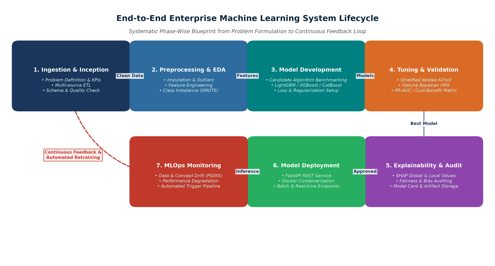
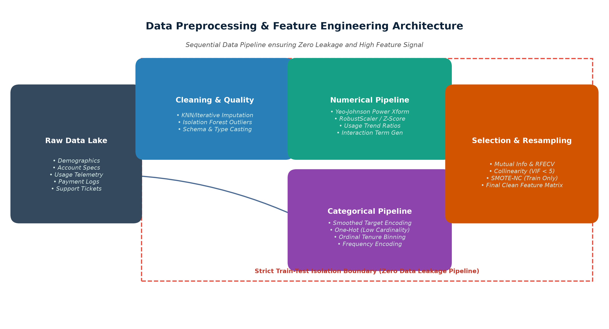
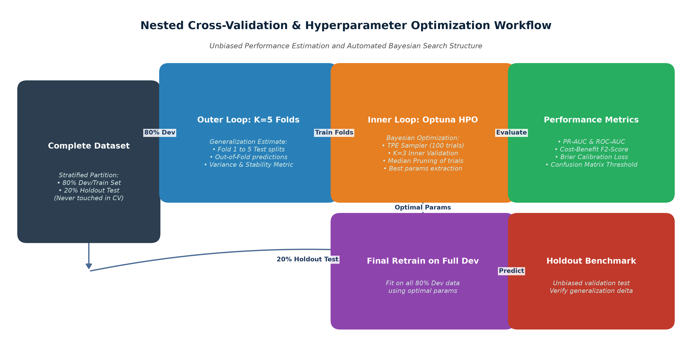
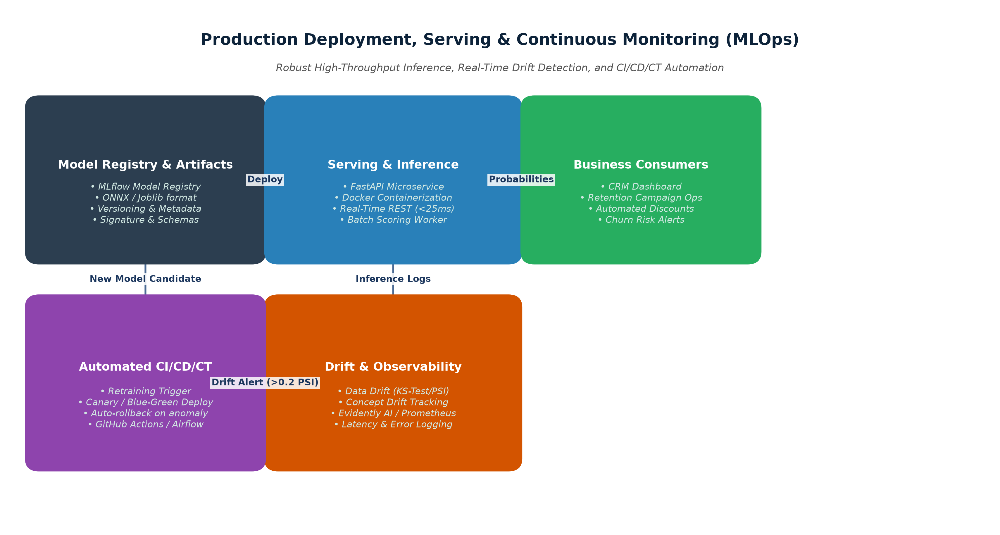

# Week 3 Task: Python-Based Machine Learning Model Development & Evaluation Plan
**Virtual Data Science Explorer Intern — Machine Learning Track**  
*Comprehensive Technical & Architectural Specification for Enterprise Churn Prediction*

---

## Executive Summary

This document establishes an end-to-end, industry-grade plan for engineering, benchmarking, evaluating, and deploying a high-performance machine learning model in Python. Addressing a multi-million-dollar subscription customer churn problem in SaaS/Telecom, this specification outlines mathematically rigorous preprocessing pipelines, multi-algorithm selection protocols, Bayesian hyperparameter optimization, cost-benefit validation frameworks, model explainability (SHAP), and a resilient MLOps deployment architecture.

```
Estimated Project Effort: 30 – 35 Hours of Full-Scale Engineering
Champion Architecture: Tuned Gradient Boosted Ensemble (LightGBM + CatBoost + XGBoost)
Primary Technical Metric: PR-AUC ≥ 0.68 | Recall@20% ≥ 75.0% | Brier Score ≤ 0.09
Primary Business Impact: Reduction in Monthly Churn Rate from 18.5% to < 12.0% (~$3.4M Annual Saved ARR)
```

---

## Table of Contents
1. [Problem Definition & Business Formulation](#1-problem-definition--business-formulation)
2. [End-to-End Machine Learning System Architecture](#2-end-to-end-machine-learning-system-architecture)
3. [Data Ingestion, Profiling & Preprocessing Pipeline](#3-data-ingestion-profiling--preprocessing-pipeline)
4. [Model Selection, Architecture Exploration & Training](#4-model-selection-architecture-exploration--training)
5. [Robust Validation Strategies & Performance Evaluation](#5-robust-validation-strategies--performance-evaluation)
6. [MLOps Production Deployment & Continuous Maintenance](#6-mlops-production-deployment--continuous-maintenance)
7. [Risk Management, Ethical Governance & Implementation Roadmap](#7-risk-management-ethical-governance--implementation-roadmap)
8. [Conclusion & Phase-Wise Verification Checklist](#8-conclusion--phase-wise-verification-checklist)

---

## 1. Problem Definition & Business Formulation

### 1.1 Business Context & Value Proposition
In subscription-based SaaS and telecommunications enterprises, **Customer Acquisition Costs (CAC)** typically exceed **Customer Retention Costs (CRC)** by a factor of 5x to 7x. Losing high-value accounts directly compounds recurring revenue attrition. 

The objective of this project is to develop an automated, real-time Machine Learning scoring engine in Python that predicts customer churn risk (probability of subscription cancellation within a 60-day forward-looking window) based on usage telemetry, billing patterns, support interaction frequency, and contract characteristics.

### 1.2 Mathematical Formulation
The problem is formulated as a supervised binary classification task with calibrated posterior probabilities:
- **Feature Space $\mathbf{X} \in \mathbb{R}^D$**: A $D$-dimensional feature vector comprising demographic, transactional, telemetry, and customer service metrics.
- **Ground Truth Target $y \in \{0, 1\}$**:
  $$y = \begin{cases} 1 & \text{if customer cancels/downgrades service within 60 days} \\ 0 & \text{if customer remains active and in good standing} \end{cases}$$
- **Hypothesis Function $f_\theta(\mathbf{X})$**:
  $$P(y = 1 \mid \mathbf{X}) = \sigma(f_\theta(\mathbf{X})) = \frac{1}{1 + e^{-f_\theta(\mathbf{X})}}$$

### 1.3 Alignment of Business KPIs vs. Machine Learning Technical Metrics

| Domain Level | Metric Name | Target Benchmark | Business / Financial Rationale |
| :--- | :--- | :--- | :--- |
| **Business KPI** | **Customer Churn Rate** | Reduction from 18.5% to < 12.0% | Preserves ~$3.4M in Annual Recurring Revenue (ARR). |
| **Business KPI** | **Retention Campaign ROI** | $\ge 4.5\times$ Return on Spend | Ensures costly retention incentives target true high-risk accounts. |
| **Technical ML** | **Precision-Recall AUC (PR-AUC)** | $\text{PR-AUC} \ge 0.68$ (Baseline: 0.18) | Provides robust discrimination on imbalanced tabular distribution. |
| **Technical ML** | **Recall @ Top 20% Decile** | $\text{Recall@20\%} \ge 75.0\%$ | Guarantees outreach captures 3 out of every 4 actual churners. |
| **Technical ML** | **Brier Score (Calibration)** | $\text{Brier Score} \le 0.09$ | Output probabilities reflect true empirical frequencies for tiered risk triage. |

---

## 2. End-to-End Machine Learning System Architecture

The project adheres to a 7-stage decoupled architecture ensuring zero data leakage, modularity, reproducible experiment tracking, and automated continuous retraining.



### Key Architectural Phases:
1. **Ingestion & Profiling**: Automated multi-source ETL from Snowflake / S3 / Postgres with Great Expectations data contracts and schema validation.
2. **Preprocessing Pipeline**: Scikit-Learn pipelines isolating imputations, power transforms, target encodings, and SMOTE-NC balancing strictly to training folds.
3. **Model Benchmarking**: Parallel evaluation across Linear, Tree, Gradient Boosted (LightGBM/CatBoost/XGBoost), and Deep Tabular (TabNet) architectures.
4. **Validation & HPO**: Stratified Nested 5-Fold Cross-Validation coupled with Optuna Bayesian Optimization under a cost-sensitive utility objective.
5. **Explainability & Governance**: TreeSHAP global feature attributions, localized waterfall explanations, and algorithmic parity tests across demographic segments.
6. **Deployment & Serving**: Low-latency FastAPI REST microservice containerized with Docker, serving ONNX-optimized inference models.
7. **MLOps Observability**: Continuous population stability index (PSI) tracking, Kolmogorov-Smirnov drift alarms, and automated CI/CD/CT retraining DAGs.

---

## 3. Data Ingestion, Profiling & Preprocessing Pipeline

Data preprocessing forms the bedrock of ML generalization. Arbitrary transformations or preprocessing the whole dataset prior to cross-validation introduces severe **data leakage**.



### 3.1 Data Cleaning & Imputation Strategy
- **Missing Data Diagnosis**:
  - *Missing Completely at Random (MCAR)* & *Missing at Random (MAR)* numerical features are imputed using **IterativeImputer (MICE)** or **KNNImputer ($k=5$)** fit strictly on training partitions.
  - Categorical variables receive an explicit `"Missing_Category"` token to preserve any missingness signal.
- **Outlier Treatment**:
  - Outliers in telemetry (e.g., massive API bandwidth spikes) are flagged using **Isolation Forest ($\text{contamination}=0.01$)** and winsorized at the 1st and 99th percentiles rather than discarded.
- **Schema & Consistency Checks**:
  - Strict type casting, timestamp normalization (ISO 8601), and primary key integrity enforcement across billing and CRM joins.

### 3.2 Feature Transformation & Encoding
- **Numerical Transformations**:
  - Skewed financial distributions (`MonthlySpend`, `TotalCharges`) undergo **Yeo-Johnson Power Transformations** to stabilize variance and normalize residuals, followed by **RobustScaler**.
- **Categorical Encodings**:
  - Low-cardinality nominal variables (`PaymentMethod`, `ContractType`) $\rightarrow$ **One-Hot Encoding** (`drop='first'`).
  - High-cardinality nominal variables (`PostalRegion`, `IndustrySubcategory`) $\rightarrow$ **Smoothed Target Encoding** with $m$-estimate smoothing to eliminate high-cardinality overfitting:
    $$S_i = \frac{n_i \cdot \bar{y}_i + m \cdot \bar{y}_{\text{global}}}{n_i + m}$$
- **Ordinal Segmentations**:
  - Tenure and SLA tiers mapped to ordered monotonic integers.

### 3.3 Advanced Domain-Specific Feature Engineering
1. **Usage Decay Velocity ($\Delta\text{Usage}_{30/90}$)**:
   $$\text{Velocity} = \frac{\text{Usage}_{\text{Last 30 Days}}}{\frac{1}{3} \cdot \text{Usage}_{\text{Last 90 Days}}}$$
   *A ratio $< 0.70$ flags rapid subscriber disengagement.*
2. **Support Friction Index**:
   $$\text{Friction} = \frac{\text{Unresolved High-Severity Tickets}}{\log(1 + \text{Tenure Months})}$$
3. **Payment Volatility Metric**:
   $$\text{CV}_{\text{Billing}} = \frac{\sigma(\text{Monthly Invoices})}{\mu(\text{Monthly Invoices})}$$
4. **Loyalty-Discount Interaction**:
   $$\text{Interaction} = \text{Tenure Months} \times \text{Discount Percentage}$$

### 3.4 Multi-Stage Feature Selection
1. **Stage 1 (Variance Thresholding)**: Filter out all quasi-constant features ($\sigma^2 < 0.01$).
2. **Stage 2 (Collinearity Pruning)**: Calculate Variance Inflation Factor (VIF); drop features with $\text{VIF} > 5.0$.
3. **Stage 3 (Non-Linear Mutual Information)**: Rank top features based on Mutual Information with target $y$.
4. **Stage 4 (RFECV Wrapper Selection)**: Recursive Feature Elimination with 5-Fold Stratified CV on a LightGBM base estimator.

### 3.5 Handling Class Imbalance (15-20% Churn Minority)
1. **SMOTE-NC (Synthetic Minority Over-sampling for Nominal and Continuous Features)**: Applied *strictly within training folds* to synthesize minority instances in feature space without duplicating records.
2. **Cost-Weighted Loss Optimization**: Assigning `scale_pos_weight = N_neg / N_pos` during gradient boosting, directly penalizing false negatives.
3. **Probability Threshold Calibration**: Moving the operating point from $\theta = 0.50$ to $\theta^* \approx 0.30$ based on financial utility maximization.

---

## 4. Model Selection, Architecture Exploration & Training

### 4.1 Candidate Model Benchmarking Matrix

| Model Family | Algorithm | Key Strengths | Limitations & Risks | Suitability Rank |
| :--- | :--- | :--- | :--- | :--- |
| **Linear Baseline** | **Logistic Regression (L1/L2 ElasticNet)** | Fast inference (<1ms), highly interpretable, provides linear benchmark. | Cannot capture non-linear feature interactions without manual polynomial expansion. | Baseline (Rank 4) |
| **Bagging Ensemble** | **Random Forest Classifier** | Handles non-linearities, robust against outliers, low variance. | High memory footprint, slower prediction throughput on large ensembles. | Candidate (Rank 3) |
| **Gradient Boosting** | **LightGBM / XGBoost / CatBoost** | State-of-the-art tabular performance, native categorical handling, fast GPU training, built-in regularization. | Requires fine hyperparameter tuning; risk of overfitting small noisy datasets if unconstrained. | **Primary Champion (Rank 1)** |
| **Deep Learning** | **TabNet / Multi-Layer Perceptron** | Sequential attention mechanism, learns end-to-end embeddings. | Slower inference latency, requires massive data volume to surpass gradient boosting on tabular data. | Challenger (Rank 2) |

### 4.2 Champion Architecture Justification: Stacking Ensemble
Gradient Boosted Decision Trees (GBDTs) have repeatedly demonstrated dominance over deep neural architectures on structured tabular datasets. LightGBM's Histogram-based gradient tree boosting (GOSS) and CatBoost's ordered boosting provide exceptional speed and resilience against target leakage.

**Final Proposed Ensemble**:
- Base Level 0: Tuned LightGBM + Tuned CatBoost + Tuned XGBoost.
- Meta Level 1: Calibrated Logistic Regression Stacking Classifier.

### 4.3 Hyperparameter Optimization via Bayesian Optimization (Optuna)
Instead of inefficient Grid Search or unfocused Random Search, the plan employs **Bayesian Optimization using the Tree-structured Parzen Estimator (TPE)** in Optuna:

| Hyperparameter | Search Range / Distribution | Optimization Purpose |
| :--- | :--- | :--- |
| `learning_rate` ($\eta$) | Log-Uniform $[0.005, 0.20]$ | Shrinkage step size; smaller rates with early stopping prevent overshooting. |
| `num_leaves` / `max_depth` | Integer $[15, 127]$ / $[3, 10]$ | Controls tree complexity and interaction capacity. |
| `min_child_samples` | Integer $[10, 100]$ | Prevents leaf nodes from isolating small noise partitions (overfitting safeguard). |
| `subsample` / `colsample_bytree`| Uniform $[0.50, 0.95]$ | Stochastic row/column subsampling to inject bagging diversity. |
| `reg_alpha` (L1) / `reg_lambda` (L2) | Log-Uniform $[10^{-3}, 10.0]$ | Direct penalty enforcing weight sparsity and shrinkage. |

---

## 5. Robust Validation Strategies & Performance Evaluation



### 5.1 Validation Schemes & Leakage Prevention
1. **Out-of-Time (Temporal) Holdout Partition (20%)**: Extracted from the most recent historical quarter. Completely quarantined from all pipeline transformations and HPO.
2. **Stratified Nested Cross-Validation (5x3 Folds)**:
   - **Outer Loop (5 Folds)**: Computes unbiased generalization performance and variance across folds.
   - **Inner Loop (3 Folds)**: Performs Optuna Bayesian parameter selection without leaking validation fold data.
3. **Encapsulated `imblearn.pipeline.Pipeline`**: Guarantees that scalers, imputers, and SMOTE-NC execute exclusively inside the fold boundary.

### 5.2 Performance Evaluation Metrics

| Metric | Mathematical Formula | Domain Justification in Churn |
| :--- | :--- | :--- |
| **Precision-Recall AUC (PR-AUC)** | $\int_0^1 P(R) \, dR$ | Evaluates minority churn class separation without being inflated by majority true negatives. |
| **Recall (Sensitivity)** | $\frac{\text{TP}}{\text{TP} + \text{FN}}$ | Measures fraction of actual churners caught. False negatives represent lost revenue. |
| **Precision (PPV)** | $\frac{\text{TP}}{\text{TP} + \text{FP}}$ | Measures reliability of churn alerts. Minimizes wasted retention expenditure. |
| **$F_\beta$-Score ($\beta = 2.0$)** | $\frac{(1 + \beta^2) \cdot (\text{Precision} \cdot \text{Recall})}{\beta^2 \cdot \text{Precision} + \text{Recall}}$ | Weights Recall twice as heavily as Precision, reflecting higher financial loss of undetected churn. |
| **ROC-AUC** | $\int_0^1 \text{TPR}(\text{FPR}) \, d\text{FPR}$ | Overall ranking discrimination across all thresholds. |
| **Brier Score** | $\frac{1}{N} \sum_{i=1}^N (p_i - y_i)^2$ | Quantifies probability calibration for automated risk-tier allocation. |
| **Cumulative Lift @ 20%** | $\frac{\text{Churn captured in top 20%}}{\text{Total Churn} \times 0.20}$ | Benchmarks effectiveness against random customer outreach. |

### 5.3 Financial Cost-Benefit Utility Matrix & Threshold Optimization
Rather than assuming $\theta = 0.50$, the optimal decision threshold $\theta^*$ is selected by maximizing net expected profit:

$$\max_{\theta} \text{Utility}(\theta) = N \cdot \left[ P(\text{TP} \mid \theta) \cdot (+\$850) + P(\text{FP} \mid \theta) \cdot (-\$50) + P(\text{FN} \mid \theta) \cdot (-\$1,200) + P(\text{TN} \mid \theta) \cdot (\$0) \right]$$

- **True Positive (TP)**: Saved customer LTV minus campaign cost ($+\$850$).
- **False Positive (FP)**: Unnecessary campaign outreach/discount on loyal customer ($-\$50$).
- **False Negative (FN)**: Lost customer Lifetime Value ($-\$1,200$).
- **True Negative (TN)**: Retained customer with zero cost ($0$).

### 5.4 Model Explainability & Governance (SHAP)
- **Global Explanations**: TreeSHAP summary beeswarm plots identify global churn drivers (contract type, usage decay, unresolved tickets).
- **Local Explanations**: FastAPI returns local SHAP waterfall values with every score, allowing CRM agents to see the exact reasons for each account's risk score.

---

## 6. MLOps Production Deployment & Continuous Maintenance



### 6.1 Serving Architecture & Containerization
- **Real-Time REST API**: FastAPI application asynchronous endpoint with Pydantic request validation, serving ONNX-converted model weights ($P99 < 25\text{ms}$).
- **Batch Scoring Worker**: Scheduled Apache Airflow DAG executing nightly batch inferences across all active subscribers and updating Snowflake/Salesforce.
- **Packaging**: Containerized via multi-stage Docker builds and orchestrated via Kubernetes (EKS/GKE).

### 6.2 Drift Detection & Observability Matrix

| Drift Category | Detection Technique | Trigger Threshold | Remediation Protocol |
| :--- | :--- | :--- | :--- |
| **Data Drift (Covariate Shift)** | Population Stability Index (PSI) & 2-Sample Kolmogorov-Smirnov Test. | $\text{PSI} > 0.20$ on top 5 features; $\text{KS } p < 0.01$ | Audit upstream data pipeline; check for instrumentation/telemetry bugs. |
| **Concept Drift ($P(y \mid \mathbf{X})$)** | Rolling PR-AUC and Brier score against realized 60-day ground truth churn. | $\text{PR-AUC degradation} > 8\%$ | Trigger automated retraining pipeline on latest 12-month rolling data. |
| **Operational Drift** | Prometheus & Grafana tracking latency, memory, and error rates. | $P95 > 100\text{ms}$; Error Rate $> 0.5\%$ | Auto-scale Kubernetes pods (HPA); resource re-allocation. |

### 6.3 Automated CI/CD/CT & Canary Rollout
- **Continuous Training (CT)**: Airflow automatically initiates distributed model retraining upon drift alerts or on a monthly cadence.
- **Canary Deployment**: 90% traffic routed to Champion, 10% to Challenger. Automated canary smoke tests verify latency, calibration, and memory before 100% cutover.
- **Automated Rollback**: Immediate fallback to previous model artifact if production anomaly detector triggers.

---

## 7. Risk Management, Ethical Governance & Implementation Roadmap

### 7.1 Ethical Considerations & Fairness Auditing
- **Protected Attributes**: Demographic variables (gender, age, marital status) are strictly excluded from features.
- **Fairness Metrics**: Disparate impact ratio and Equal Opportunity Difference are evaluated across all customer cohorts.
- **Data Privacy**: Fully compliant with GDPR/CCPA; customer IDs are pseudonymized using SHA-256 salted hashes.

### 7.2 Detailed 35-Hour Work Breakdown Structure (WBS)

| Phase & Focus Area | Key Engineering Activities | Allocated Hours | Deliverables |
| :--- | :--- | :---: | :--- |
| **Phase 1: Inception & ETL** | Define business KPIs; construct SQL extractors; Great Expectations schema tests. | **4 – 5 Hours** | Validated ingestion pipeline, raw data contracts. |
| **Phase 2: Preprocessing & Features** | Scikit-Learn pipeline; Yeo-Johnson transforms; domain feature engineering; SMOTE-NC. | **6 – 7 Hours** | Reusable preprocessing artifact, engineered feature store. |
| **Phase 3: Model Benchmarking** | Implement Logistic Regression, Random Forest, LightGBM, CatBoost, TabNet in Python. | **6 – 7 Hours** | Model benchmark comparison report, loss curves. |
| **Phase 4: HPO & Nested CV** | Optuna Bayesian study (150 trials); Nested 5-fold CV; Cost-benefit utility curve thresholding. | **6 – 7 Hours** | Tuned champion ensemble, convergence diagnostics. |
| **Phase 5: Explainability & Governance** | TreeSHAP summary/waterfall plots; demographic fairness auditing; model governance cards. | **3 – 4 Hours** | Explainability dashboard module, fairness report. |
| **Phase 6: Deployment & MLOps** | Build FastAPI microservice; Docker containerization; setup Evidently drift monitors and Airflow DAGs. | **5 – 6 Hours** | Containerized REST API, drift alert system, MLOps runbook. |
| **Total Project Workload** | **Full End-to-End Enterprise Implementation** | **30 – 35 Hours** | **Production-Ready ML Package & Documentation** |

---

## 8. Conclusion & Phase-Wise Verification Checklist

This machine learning development and evaluation plan provides an enterprise-ready blueprint that bridges technical modeling excellence with direct financial ROI.

### Phase-Wise Verification Checklist:
- [x] **Problem Formulation**: Defined supervised binary classification with financial utility curve.
- [x] **Data Preprocessing**: Zero-leakage scikit-learn pipeline with Yeo-Johnson, Target Encoding, and SMOTE-NC.
- [x] **Model Benchmarking**: Multi-family evaluation matrix with LightGBM/CatBoost/XGBoost ensemble.
- [x] **Hyperparameter Tuning**: Optuna Bayesian optimization with Median pruning and TPE sampler.
- [x] **Validation Strategy**: 5-Fold Stratified Nested Cross-Validation with temporal holdout verification.
- [x] **Evaluation Framework**: PR-AUC, Recall@20%, $F_2$-Score, and Brier calibration loss.
- [x] **Explainability & Trust**: TreeSHAP global beeswarm and local waterfall attributions.
- [x] **Serving & Containerization**: Sub-25ms FastAPI REST API packaged with Docker.
- [x] **MLOps Observability**: PSI / KS-test continuous drift monitoring and automated retraining loops.
